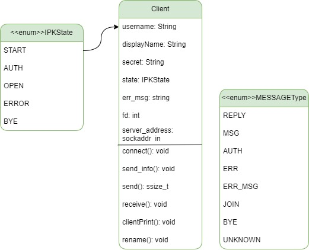
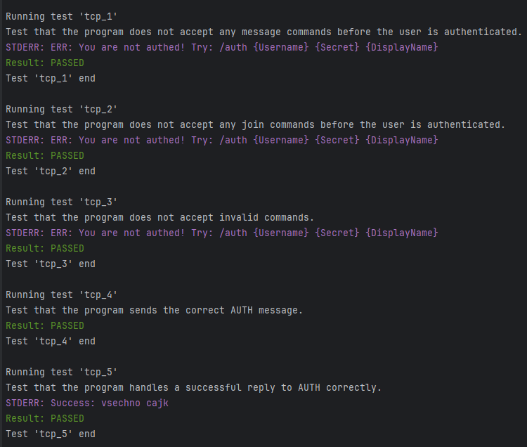
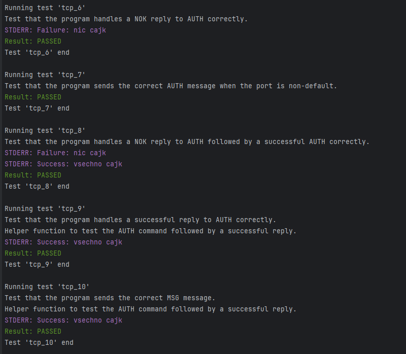
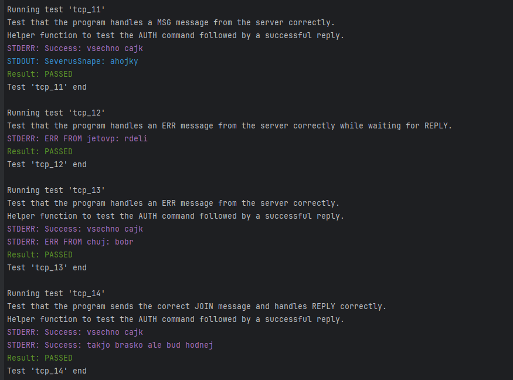
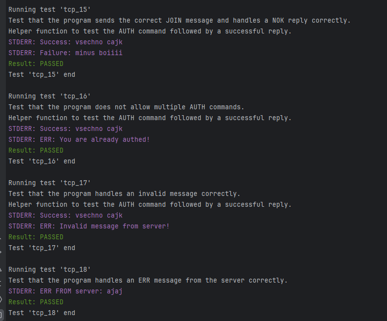

### IPK Project 1: Client for a chat server using IPK24-CHAT protocol (only TCP)
### Jméno a příjmení: Denys Dumych
### Login: xdumyc00

---

#### 1. Content Structuring

The code consists of three files:

1. **main.cpp**: This file contains the main function where the client application logic is implemented. It includes parsing command-line arguments, configuring the client, setting up epoll, handling user input, managing communication with the server, and cleaning up resources.

2. **IPKClient.cpp**: This file implements the IPKClient class, which encapsulates the client's functionality. It includes methods for establishing a connection with the server, sending and receiving messages, handling various message types, and managing the client's state.

3. **IPKClient.h**: This header file declares the IPKClient class along with necessary includes and enum classes for defining the client's state and message types.

---

#### 2. Executive Summary

The implemented application is a client for a network communication system. It allows users to connect to a server, authenticate themselves, join channels, send messages, and perform other operations. Below is an overview of the key components and functionalities:

- **IPKClient Class**: Encapsulates the client's functionality, including establishing a connection with the server, sending and receiving messages, and managing the client's state.

- **Main Functionality**:
    - **Parsing Arguments**: Parses command-line arguments to determine the server's hostname, port number, communication mode (TCP), and other parameters.
    - **Configuring Client**: Creates and configures the client based on the provided arguments, including establishing a connection with the server.
    - **Setting up Epoll**: Utilizes epoll to handle multiple file descriptors asynchronously, including stdin and the client socket.
    - **Handling User Input**: Reads user input from stdin asynchronously and processes it according to the client's state.
    - **Managing Communication**: Sends messages to the server based on user input and receives and processes messages from the server.
    - **Cleaning Up Resources**: Properly closes file descriptors and cleans up resources upon termination.

- **Message Types**:
    - **REPLY**: Response from the server indicating the status of an action.
    - **MSG**: Regular chat messages sent between users.
    - **ERR_MSG**: Error messages or notifications from the server.
    - **AUTH, JOIN, BYE**: Special message types for authentication, joining channels, and terminating the connection.

- **Error Handling**: Handles various error conditions gracefully, including invalid inputs, connection failures, and server responses.

This client application facilitates communication with a server in a networked environment, providing users with the ability to interact with the server and other clients using a command-line interface.

---

#### 3. UML Diagrams and Narrative
- **Handling User Input Asynchronously**. Handling of user input asynchronously using the epoll mechanism. This allows the client application to efficiently wait for and process input from both the server and the user without blocking execution.

- **Dynamic Message Handling Based on Client State**. Another intriguing aspect is the dynamic message handling based on the client's state. The IPKClient class encapsulates the client's functionality, including its state, which can be one of the following:
  - **START**: Initial state when the client is instantiated.
  - **AUTH**: State indicating that the client is in the process of authenticating with the server.
  - **OPEN**: State indicating that the client is authenticated and has an open connection with the server.
  - **ERROR**: State indicating that an error has occurred.
  - **BYE**: State indicating that the client is terminating the connection.

  Depending on the client's state, different types of messages are sent, received, and processed.

  

- **Message Parsing and Formatting**. The code is parsing and formatting messages exchanged between the client and the server. It uses vector and strings to construct and parse messages with varying structures and content types. These ensure that messages are transmitted and processed accurately.

- **Error Handling and Resource Cleanup**. The code handle unexpected situations and prevent resource leaks. Error conditions such as connection failures, invalid inputs, or server responses are detected and handled appropriately, with error messages provided to the user. Resources such as file descriptors and epoll instances are properly closed and cleaned up.

- **Object-Oriented Design**.The use of object-oriented design principles, particularly the encapsulation of client functionality within the IPKClient class. By encapsulating related functionality and state within a single class, the code becomes more organized, reusable, and easier to maintain.

---

#### 4. Testing
The program was ran and fully functional on the custom shared development environments.
Also here are some custom tests results.

---

#### 5. Bibliography (sources)

* GeeksforGeeks. (n.d.). different articles [24.03.2024]; URL: https://www.geeksforgeeks.org/
* Habr. (n.d.) different articles [23.03.2024]; URL: https://www.habr.com
* Ing. Daniel Dolejška, Ing. Vladimír Veselý Ph.D., IPK lectures, [cited 22.03.2024]
* Online resources: youtube, medium etc.
